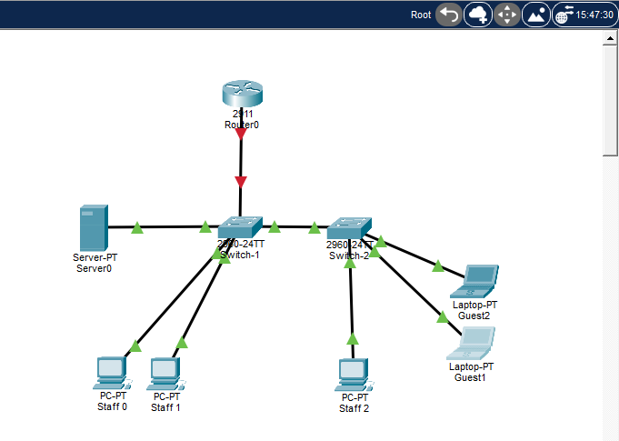

# Harbour Tech Ltd: Small Office Network (Cisco Packet Tracer)

A small multi-VLAN office network I designed, built, secured and tested in Cisco Packet Tracer, as hands-on practice alongside my Networking Technologies degree at TU Dublin and my CCNA preparation.

The full step-by-step log, with every command, screenshot and test, is in [Harbour-Tech-Project-Log-Leo.pdf](Harbour-Tech-Project-Log-Leo.pdf).

## Scenario

Harbour Tech Ltd is a fictional small office with staff workstations, a guest area and an internal file server. The network had to:

- Separate Staff, Guest and Server traffic into their own VLANs
- Route between VLANs through a single router (router-on-a-stick)
- Give staff and guest devices addresses automatically with DHCP
- Stop guests from reaching the server network
- Allow device management only over SSH, from a dedicated management VLAN

## Topology

- **R1:** Cisco 2911 router (router-on-a-stick on G0/0)
- **SW1, SW2:** Cisco 2960 switches, linked by an 802.1Q trunk
- **SW1:** Staff 0, Staff 1, Server
- **SW2:** Staff 2, Guest 1, Guest 2

## Addressing plan

| VLAN | Name | Subnet | Gateway | Addressing |
|---|---|---|---|---|
| 10 | STAFF | 10.10.10.0/24 | 10.10.10.1 | DHCP (.21+) |
| 20 | GUEST | 10.10.20.0/24 | 10.10.20.1 | DHCP (.21+) |
| 30 | SERVER | 10.10.30.0/24 | 10.10.30.1 | Static (server .10) |
| 99 | MGMT | 10.10.99.0/24 | 10.10.99.1 | Static (SW1 .11, SW2 .12) |
| 999 | NATIVE_UNUSED | none | none | Native VLAN on trunks only |

## Features

- VLAN segmentation with VTP (SW1 server, SW2 client, password protected)
- 802.1Q trunks with an unused native VLAN (999), so no traffic crosses the trunks untagged
- Inter-VLAN routing with router-on-a-stick subinterfaces
- DHCP on R1 with .1–.20 reserved in each client VLAN for static devices
- Extended ACL `GUEST_BLOCKER` stopping Guest → Server traffic
- SSH v2 only management (2048-bit RSA, local users, enable secret); Telnet refused
- Unused switch ports shut down; DNS lookup disabled on all devices

## Key design decisions

- **ACL inbound on G0/0.20.** Extended ACLs go as close to the source as possible. Guest traffic to the servers is dropped as it enters R1, before routing. Applying it outbound on G0/0.30 would make R1 route the packet first and inspect all traffic heading to the servers, staff traffic included.
- **Separate management VLAN.** Switches are only reachable on VLAN 99, away from user traffic and away from the default VLAN 1.
- **Native VLAN 999.** VLAN 99 started as the native VLAN; I moved native to an unused VLAN so management traffic is always tagged.
- **Staff PCs on both switches.** Done on purpose, to prove VLAN 10 is carried correctly across the trunk.

## Testing

Every test was chosen to prove one specific link or device, and TTL values were used to confirm the path (128 same VLAN, 127 one routed hop, 255 the router itself).

| Test | Expected | Result |
|---|---|---|
| Staff 2 → Staff 0 (same VLAN, across trunk) | Success | ✅ |
| Staff / Guest → other VLANs | Success | ✅ |
| Guest 1 → Server (after ACL) | Blocked | ✅ blocked |
| Server → Guest 1 (after ACL) | Fails (guest's reply is denied) | ✅ fails |
| Staff 0 → Server (after ACL) | Success | ✅ |
| SSH from Staff 0 to R1, SW1, SW2 | Success | ✅ |
| Telnet to SW1 | Refused | ✅ refused |
| SSH from Guest 1 to SW1 | Should be blocked | ⚠️ reachable, gap found |

## Problems encountered

1. **Guest received an address from the reserved range.** `show run | include excluded` showed the GUEST DHCP exclusion had never been applied. Added it, cleared the bindings and renewed.
2. **ACL had no effect.** The ACL was created as `GUEST_BLOCKER` but applied as `GUEST_BLOCK`. IOS accepts a reference to a non-existent ACL without warning and permits everything. Found through the interface config and the ACL match counters, then re-applied with the correct name.
3. **`enable` refused over SSH.** IOS blocks privileged access over VTY lines when no enable secret is set. Configured an enable secret on all devices.

## Future improvements

- Block Guest → MGMT and restrict VTY logins to the Staff subnet with an `access-class`
- Limit trunks to the VLANs in use
- Move to VTPv3 or VTP transparent mode
- Port security on guest ports
- DNS on the server and internet access through NAT
- A second site connected with OSPF

## Files

| File | Contents |
|---|---|
| `Harbour-tech-v1.pkt` | Packet Tracer project |
| `configs/Router1_startup-config.txt`, `configs/Switch-1_startup-config.txt`, `configs/Switch-2_startup-config.txt` | Final running configurations |
| `Harbour-Tech-Project-Log-Leo.pdf` | Full build log with screenshots |
